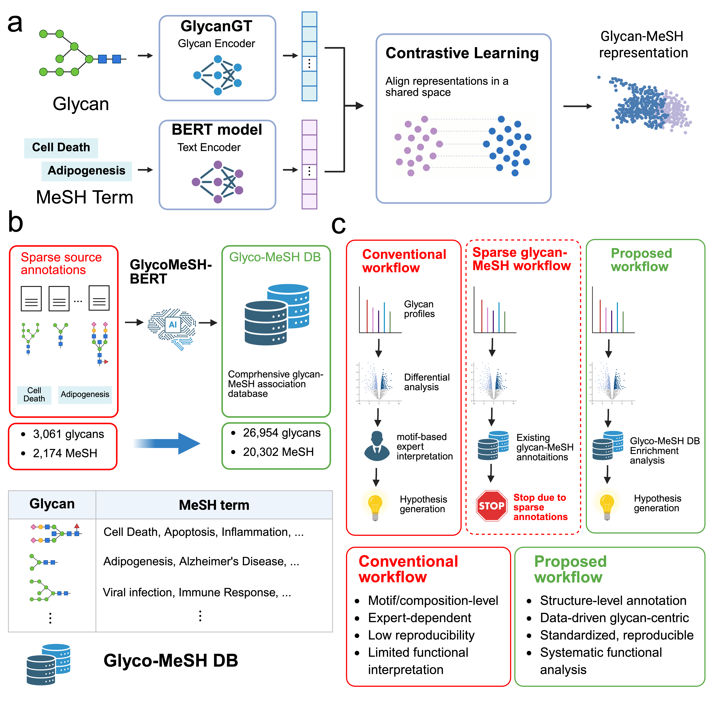
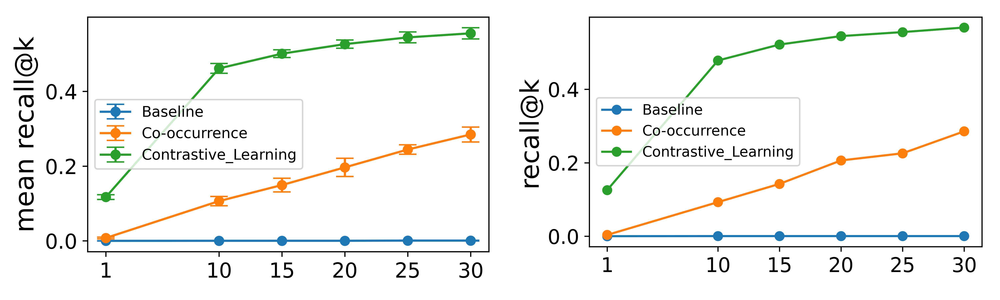
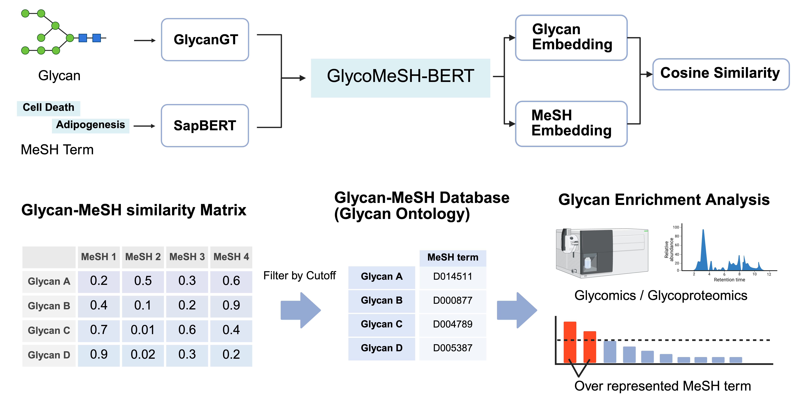
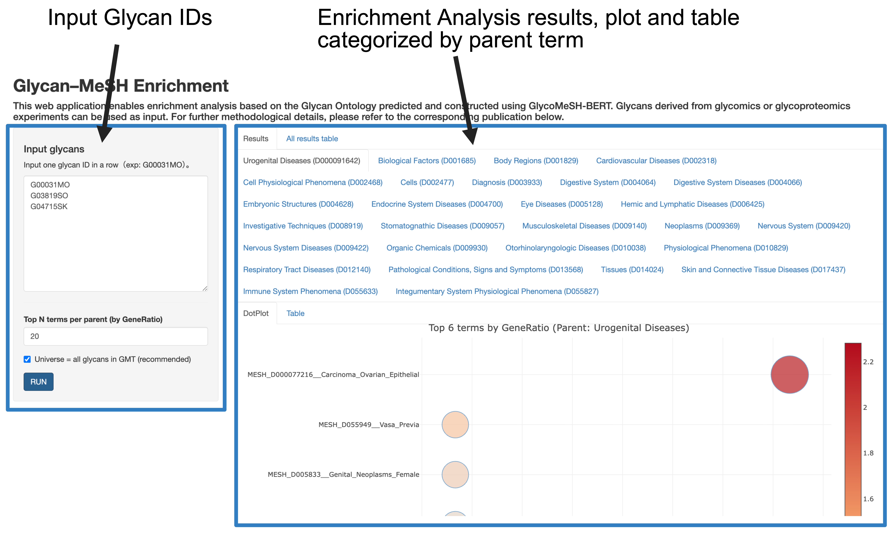

# GlycoMeSH-BERT and Glycan Ontology

Source code accompanying the manuscript  
**"Systematic functional annotation and enrichment analysis of glycans using multimodal contrastive learning."**

**GlycoMeSH-BERT** is a deep learning framework that links glycan structures with biomedical knowledge represented by Medical Subject Headings (**MeSH**) terms using multimodal contrastive representation learning.

The model learns a joint embedding space in which glycans and MeSH descriptors associated with them are positioned close together. This enables automated functional interpretation of glycan structures and prediction of biologically meaningful glycan–MeSH associations.

Using the trained model, we constructed a **Glycan Ontology** by predicting MeSH associations for glycans registered in GlyTouCan via GlyCosmos. The resulting ontology provides a non-redundant resource of glycan–MeSH associations and enables enrichment analysis for glycomics and glycoproteomics data, offering a systematic way to interpret glycan profiles without relying solely on expert knowledge.

<p align="center">
  
</p>

**Figure overview**

a. Contrastive learning framework linking glycans and MeSH terms  
b. Construction of Glycan Ontology using predicted glycan–MeSH associations  
c. Glycomics enrichment analysis enabled by the ontology  

---

## Repository layout

```text
.
├── preprocess_mesh/        # MeSH XML parsing and PMID-to-MeSH term mapping
├── mesh_embed/             # MeSH text embeddings using BioBERT, PubMedBERT, MedCPT, and SapBERT
├── train_cl/               # GlycoMeSH-BERT contrastive learning, baselines, and inference scripts
├── mlp_baselines/
│   ├── glycan_only/        # Multi-label MLP using glycan embeddings only
│   └── glycan_mesh/        # Dual MLP using glycan and MeSH embeddings
├── case_study/             # Application notes for OSCC and GPST000502 datasets
├── enrichment/             # clusterProfiler-based glycan enrichment example
├── shiny/                  # R Shiny web tool for Glycan Ontology enrichment
├── requirements.txt        # Python dependencies
├── LICENSE                 # Project license
└── .zenodo.json            # Zenodo deposit metadata
```

The scripts assume a top-level `data/` directory containing raw inputs and intermediate outputs. Raw input files are not bundled with this repository and should be obtained from the original sources listed below.

Example data layout used in the manuscript:

```text
data/
├── raw/
│   ├── desc2026.xml                        # MeSH descriptors, NLM 2026 release
│   ├── qual2026.xml                        # MeSH qualifiers, NLM 2026 release
│   └── glycan/                             # GlyCosmos exports, including PMIDs and structures
├── mesh/
│   ├── mesh_descriptors.csv
│   ├── mesh_descriptors_withTree.csv
│   ├── mesh_descriptors_filtered.csv
│   └── embedding/{biobert,pubmedbert,medcpt,sapbert}_*.csv
├── glycan/
│   ├── glytoucan_iupac_mesh.csv
│   ├── glytoucan_iupac_mesh_filtered.csv
│   └── graph_id_cluster5_5cv.csv
├── glycangt_embedding_2026/
│   └── embeddings_large.csv                # Glycan embeddings from GlycanGT
└── analysis/                               # Hyperparameter searches and final models
```

---

## Model architecture and training details

GlycoMeSH-BERT learns joint representations of glycans and biomedical concepts through contrastive learning.

### Glycan encoder

Glycan structures are encoded using **GlycanGT embeddings**, which represent glycans in a learned vector space derived from glycan structural features.

### MeSH encoder

MeSH descriptors are encoded using a **SapBERT-based language model**, allowing the model to capture semantic information from biomedical terminology.

### Contrastive learning

The two encoders are trained using a contrastive objective.

- Matched glycan–MeSH pairs are treated as positive pairs.
- Unmatched glycan–MeSH pairs are treated as negative pairs.
- The embedding space is optimized so that associated glycan–MeSH pairs are close, while unrelated pairs are separated.

This results in a shared latent space where glycans and biomedical concepts can be compared directly.

The trained embeddings can be used for:

- glycan–MeSH association prediction
- Glycan Ontology construction
- enrichment analysis of glycomics and glycoproteomics data

---

## Model performance

The performance of GlycoMeSH-BERT was evaluated on glycan–MeSH association prediction tasks using curated glycan annotation datasets.

The model demonstrated strong predictive capability in retrieving biologically relevant MeSH terms for glycans and outperformed baseline approaches used for comparison in the manuscript.

<p align="center">
  
</p>

---

## Glycan Ontology construction and enrichment analysis

Using the trained GlycoMeSH-BERT model, we constructed a **Glycan Ontology** and demonstrated its application to glycomics enrichment analysis.

### Glycan Ontology construction

The ontology was constructed through the following procedure:

1. Glycans without ambiguous sequences were collected from GlyTouCan via GlyCosmos.
2. Glycan structures were represented using GlycanGT embeddings.
3. The trained GlycoMeSH-BERT model predicted MeSH associations for each glycan.
4. High-confidence glycan–MeSH predictions were retained.
5. Predicted associations were integrated with existing literature-derived glycan–MeSH annotations.
6. Non-redundant glycan–MeSH relationships were compiled into the Glycan Ontology.

<p align="center">
  
</p>

The resulting ontology links glycans to a wide range of biomedical concepts, including:

- diseases
- tissues
- biological processes
- molecular functions

This resource provides a systematic mapping between glycan structures and biomedical knowledge.

### Glycomics enrichment analysis

Using the Glycan Ontology, glycan enrichment analysis can be performed on glycomics and glycoproteomics datasets.

This enables:

- functional interpretation of glycan profiles
- discovery of biologically relevant glycan patterns
- automated analysis pipelines for glycomics studies

Traditionally, glycan interpretation has relied heavily on expert knowledge. GlycoMeSH-BERT enables data-driven interpretation of glycomics data, allowing glycan datasets to be analyzed in a manner analogous to gene ontology enrichment analysis in genomics.

---

## Web-based enrichment analysis tool

To make the Glycan Ontology accessible to experimental researchers, we developed a web-based enrichment analysis tool.

The tool was implemented using **R Shiny**, allowing users to:

- upload glycan profiling results
- perform ontology-based enrichment analysis
- visualize associated biological annotations

The web interface enables wet-lab researchers to analyze glycomics data without requiring computational expertise.

<p align="center">
  
</p>

The Shiny application is available in the `shiny/` directory. The GMT file and parent-term mapping required to run the app are also included in this directory.

---

## Reproducing the analysis

The end-to-end pipeline consists of the following stages. Each script exposes its inputs and outputs as command-line arguments, and example invocations are included in the relevant script comments or docstrings.

### 1. MeSH preprocessing

Directory: `preprocess_mesh/`

Main scripts:

- `xml_parser.py`
- `xml_parser_qualifier.py`
- `mesh_parser_withTree.py`
- `pubmed_to_mesh.R`
- `pmid_mesh.R`

These scripts parse MeSH descriptor and qualifier XML files and construct PMID-to-MeSH mappings used to generate glycan–MeSH annotations.

### 2. MeSH embedding generation

Directory: `mesh_embed/`

Main script:

- `mesh_embed.py`

This script encodes MeSH descriptor texts using BioBERT, PubMedBERT, MedCPT, and SapBERT. The resulting embeddings are saved under `data/mesh/embedding/`.

### 3. Contrastive learning

Directory: `train_cl/`

Main scripts include:

- `hp_n_cv_rand_search_1st.py`
- `optuna_sapbert_stablerep_holdout_test_cv5_wide.py`
- `optuna_sapbert_stablerep_holdout.py`
- `train_cross_modal_stablerep_normal_cv.py`
- `train_cross_modal_stablerep_predefine_folds.py`
- `train_cross_modal_stablerep_full_train.py`
- `infer_all_topk_from_final_model.py`
- `infer_all_topk_from_optuna_2nd_Model.py`
- `baseline_cosine_retrieval_holdout_test_cv5.py`
- `global_cooccurrence_frequency_holdout_test_cv5.py`

These scripts perform hyperparameter search, cross-validation training, final model training, inference, and baseline evaluation.

### 4. MLP baselines

Directory: `mlp_baselines/`

Subdirectories:

- `glycan_only/`
- `glycan_mesh/`

These directories contain MLP-based baseline models, including Optuna hyperparameter search, full-training, inference, and resume scripts.

### 5. Enrichment analysis

Directory: `enrichment/`

Main script:

- `test.R`

This script provides a minimal example of `clusterProfiler::enricher` using the Glycan Ontology GMT file.

### 6. Web GUI

Directory: `shiny/`

Main files:

- `ui.R`
- `server.R`
- `mesh_descriptor_all.gmt`
- `mesh_with_parent.csv`

These files define the R Shiny web application for Glycan Ontology-based enrichment analysis.

---

## Data sources

The following data sources were used in this study:

- **MeSH descriptors and qualifiers**: NLM 2026 release
- **Glycan structures and glycan–PMID mappings**: GlyCosmos and GlyTouCan
- **Glycan embeddings**: GlycanGT embeddings generated using the published GlycanGT inference pipeline
- **Application datasets**: glycomics and glycoproteomics datasets used for case studies in the manuscript

Please refer to the manuscript for detailed dataset descriptions and citations.

---

## Software environment

### Python

Recommended Python version:

- Python 3.12.11

Key Python libraries include:

- PyTorch 2.5.1+cu121
- Optuna 4.7.0
- scikit-learn 1.7.0
- SciPy 1.15.3
- transformers
- pandas
- numpy

Install Python dependencies with:

```bash
pip install -r requirements.txt
```

### R

Recommended R version:

- R 4.4.0

Key R packages include:

- clusterProfiler 4.14.6
- dplyr
- tibble
- purrr
- stringr
- xml2
- httr2
- shiny
- plotly

Install R dependencies as needed:

```r
install.packages(c("dplyr", "tibble", "purrr", "stringr", "xml2", "httr2", "shiny", "plotly"))
BiocManager::install("clusterProfiler")
```

GPU is recommended for training. Inference and enrichment analysis can be run on CPU.

---

## License

This project is licensed under the Apache License 2.0.

> Note: please make sure that the repository `LICENSE` file is also updated to Apache License 2.0 if it currently contains a different license.

---

## Citation

Citation information will be provided after publication.

If you use this code before formal publication, please cite the accompanying manuscript:

**Systematic functional annotation and enrichment analysis of glycans using multimodal contrastive learning.**
